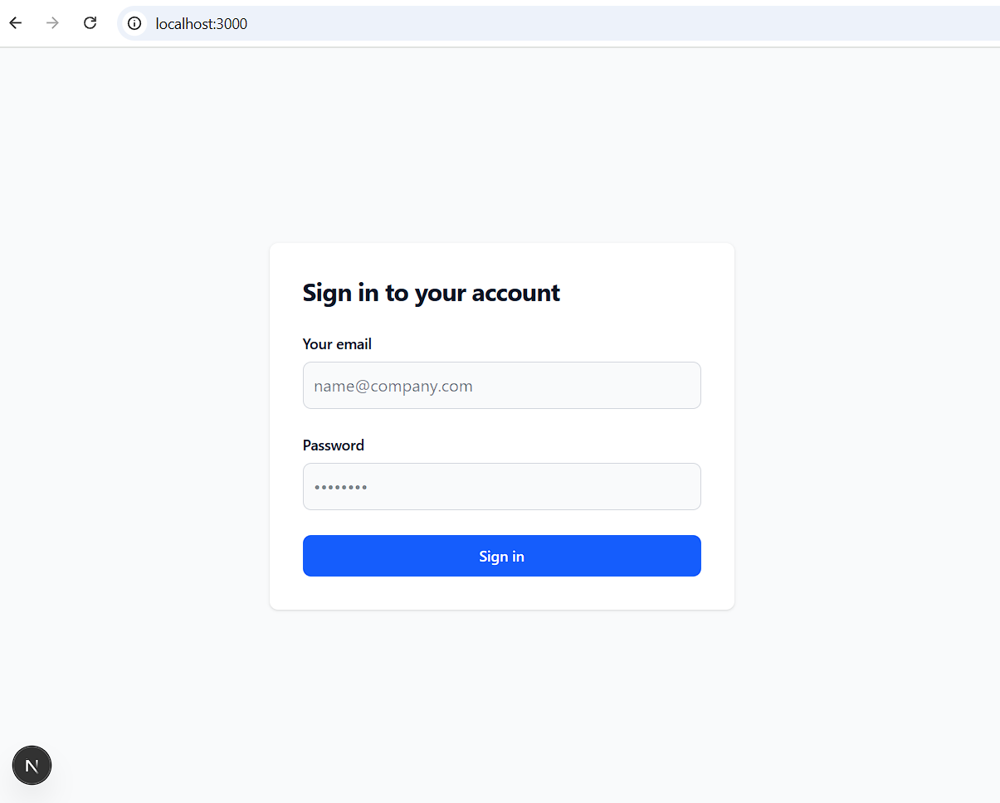

## Product Sync task

```bash
git clone https://github.com/manishaverma15/product-sync-task.git
```

```bash
cd product-sync-task
```

```bash
npm i
```

```bash
npm run dev
```


Use this mock data to login:

```bash
export const mockUsers = [{
    email: 'admin@example.com',
    password: 'admin123',
    role: 'admin'
}, {
    email: 'viewer@example.com',
    password: 'viewer123',
    role: 'viewer'
}]
```

To test app from beginning open in incognito mode or clear token

```bash
localStorage.removeItem('userToken')
```

## Screenshots


